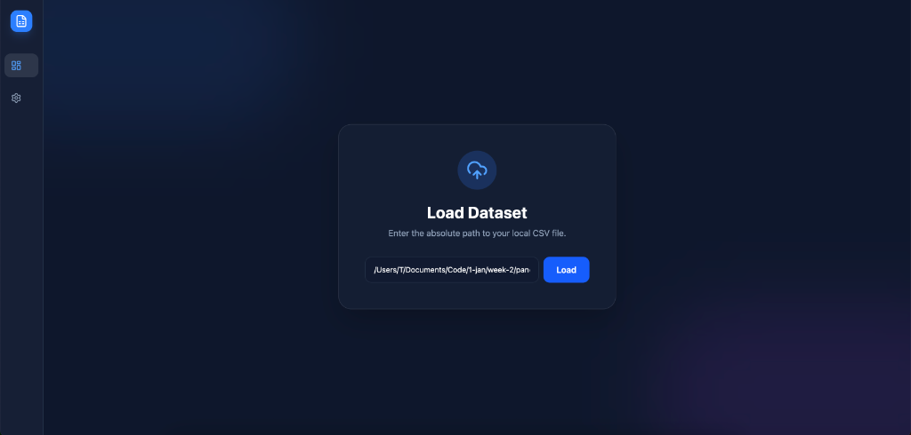

# 🐼 NumPanda Studio



**NumPanda Studio** is een geavanceerde, lokale data science workbench die de eenvoud van Pandas combineert met de kracht van NumPy en een moderne UI. Het stelt gebruikers in staat om datasets te verkennen, transformeren en visualiseren zonder een regel code te schrijven, terwijl de onderliggende Python-code (inclusief `.ipynb` notebooks) automatisch wordt gegenereerd.

## ✨ Belangrijkste Functies

### 🧠 Intelligence & Visualisatie
- **AI Magic Bar**: Vraag de AI om transformaties uit te voeren met natuurlijke taal (bijv. *"Sorteer op salaris en verwijder de id kolom"*).
- **Auto-Visualizer**: Bekijk direct distributies (histogrammen) en categorieën (taartdiagrammen) voor elke kolom.
- **Recept Historie**: Een visuele tijdlijn van al je stappen met volledige Undo/Redo ondersteuning.

### 🚀 Krachtige Transformaties
- **NumPy Integratie**: Voer razendsnelle wiskundige operaties uit (`log`, `sqrt`, `ceil`) en conditionele logica (`if/else`).
- **Data Cleaning**: Slimme suggesties voor datakwaliteit, zero-click `DropNA` / `FillNA`.
- **Veilige Architectuur**: 
    - **Secure Uploads**: Bestanden worden veilig opgeslagen met UUIDs (geen Local File Inclusion risico's).
    - **Safe Storage**: Sessies worden opgeslagen als JSON en Parquet (geen Pickle RCE risico's).
    - **Auto-Cleanup**: Tijdelijke bestanden worden automatisch opgeruimd bij herstart.

### 🛠️ Developer Friendly
- **Code Export**: Exporteer je sessie direct naar een Python script (`.py`) of Jupyter Notebook (`.ipynb`).
- **Deterministisch**: 100% reproduceerbare resultaten.

## 🏁 Aan de slag

### Vereisten
- Docker & Docker Compose

### Installatie & Start
1. Clone de repository.
2. Start de stack:
   ```bash
   docker-compose up --build
   ```
3. Open je browser op `http://localhost:5179` (of de poort die in de terminal verschijnt).

## 🏗️ Architectuur
- **Frontend**: React, TypeScript, TailwindCSS, Zustand, AG Grid, Recharts
- **Backend**: FastAPI, Pandas, NumPy, Pydantic
- **AI Engine**: Rule-based heuristics (gemakkelijk uitbreidbaar naar LLM)

---
*Gebouwd met ❤️ voor data scientists die snelheid en controle willen.*
